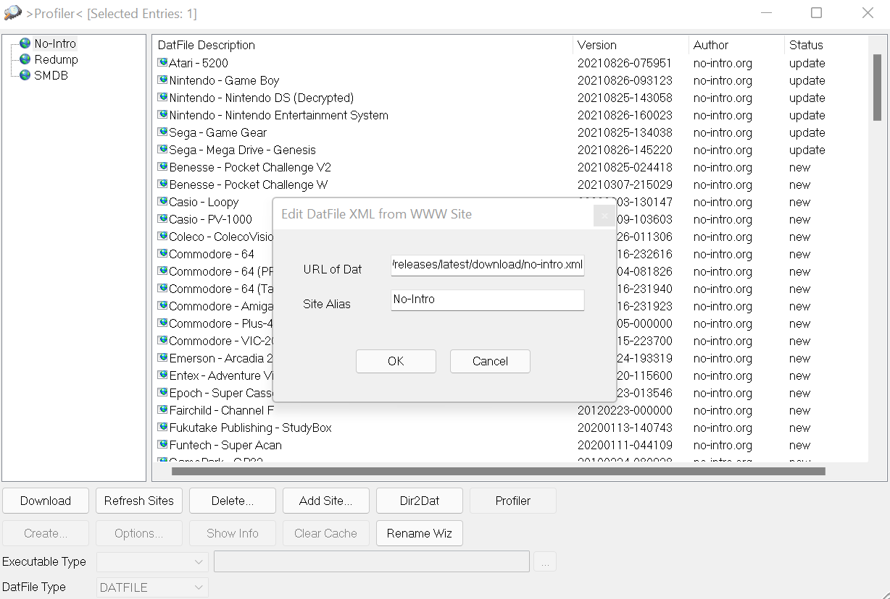
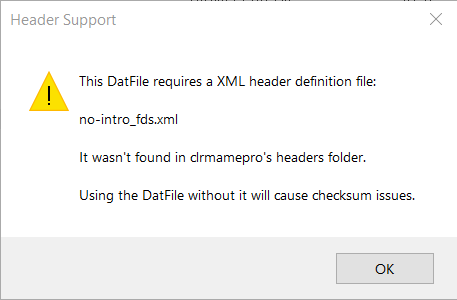

# Auto DAT file generator

WWW profiles to use in clrmamepro for the standard No-Intro and Redump sets.
Refreshes once every 24h automatically.

Note that URL sources marked with a ⬇️ have alternate feeds available, which will download the DAT files directly from their hosts, instead of from a compiled ZIP archive hosted on this repository. They may be more up-to-date by up to 24 hours, but no guarantees are offered in regards to their compatibility.

## URLs

### No-Intro

`https://github.com/dragredsim/auto-datfile-generator/releases/latest/download/no-intro.xml`

### No-Intro (parent-clone)

`https://github.com/dragredsim/auto-datfile-generator/releases/latest/download/no-intro_parent-clone.xml`

### Redump ⬇️

`https://github.com/dragredsim/auto-datfile-generator/releases/latest/download/redump.xml`

Source feed: `https://github.com/dragredsim/auto-datfile-generator/releases/latest/download/redump-source.xml`

### En-ROMs (from Archive.org) ⬇️

`https://github.com/dragredsim/auto-datfile-generator/releases/latest/download/translated-en.xml`

Source feed: `https://github.com/dragredsim/auto-datfile-generator/releases/latest/download/translated-en-source.xml`

### FinalBurn Neo ⬇️

`https://github.com/dragredsim/auto-datfile-generator/releases/latest/download/fbneo.xml`

Source feed: `https://github.com/dragredsim/auto-datfile-generator/releases/latest/download/fbneo-source.xml`

### FinalBurn Neo - Specialty

`https://github.com/dragredsim/auto-datfile-generator/releases/latest/download/fbneo-specialty.xml`

This is a feed created on-the-fly by extracting parts of the full FBNeo Arcade DAT, in order to produce a few system-specific DATs. Currently this offers DATs for the individual CPS arcade systems produced by Capcom, as some emulator frontends allow these to be their own categories. This will allow you to DAT just those systems out.

<!--- currently disabled

### Hardware Target Game Database

`https://github.com/hugo19941994/auto-datfile-generator/releases/latest/download/smdb.xml`

### Custom dats.site

`https://github.com/hugo19941994/auto-datfile-generator/releases/latest/download/dats-site.xml`

--->

Project inspired by [redump-xml-updater](https://github.com/bilakispa/redump-xml-updater)

## Header support

Some No-Intro dats require an extra XML file to detect headers.

Download the following zips, extract them and place the XML files in clrmamepro's `headers` folder:

- [Atari Jaguar](https://datomatic.no-intro.org/stuff/header_a7800.zip)
- [Atari Lynx](https://datomatic.no-intro.org/stuff/header_lynx.zip)
- [Nintendo FDS](https://datomatic.no-intro.org/stuff/header_fds.zip)
- [Nintendo NES](https://datomatic.no-intro.org/stuff/header_nes.zip)
